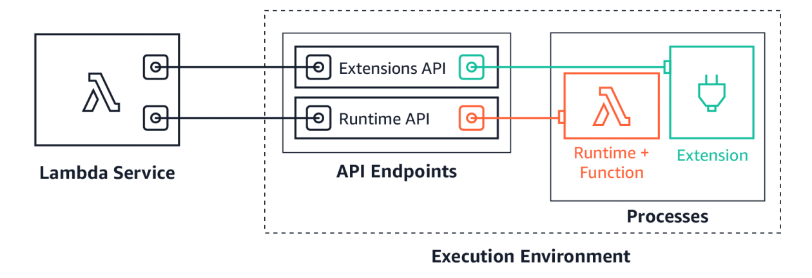

# Lambda Extension

[Lambda Extensions](https://aws.amazon.com/blogs/compute/introducing-aws-lambda-extensions-in-preview/) help solve a common request from customers to make it easier to integrate their existing tools with Lambda. Previously, customers told us that integrating Lambda with their preferred tools required additional operational and configuration tasks. In addition, tools such as log agents, which are long-running processes, could not easily run on Lambda. 
Extensions are a new way for tools to integrate deeply into the Lambda environment. There is no complex installation or configuration, and this simplified experience makes it easier for you to use your preferred tools across your application portfolio today. You can use extensions for use-cases such as:

* Capturing diagnostic information before, during, and after function invocation
* Automatically instrumenting your code without needing code changes
* Fetching configuration settings or secrets before the function invocation
* Detecting and alerting on function activity through hardened security agents, which can run as separate processes from the function

## AWS Lambda Ready Partners extensions available at launch
Today, you can use extensions with the following AWS and AWS Lambda Ready Partner’s tools, and there are more to come:
* AppDynamics
* Check Point
* Datadog
* Dynatrace
* Epsagon
* HashiCorp Vault
* Lumigo
* New Relic 
* Thundra
* AWS AppConfig
* Amazon CloudWatch Lambda Insights

## Extensions can run in either of two modes – internal and external.

* Internal extensions run as part of the runtime process, in-process with your code. They allow you to modify the startup of the runtime process using language-specific environment variables and wrapper scripts. Internal extensions enable use cases such as automatically instrumenting code.

* External extensions allow you to run separate processes from the runtime but still within the same execution environment as the Lambda function. External extensions can start before the runtime process, and can continue after the runtime shuts down. External extensions enable use cases such as fetching secrets before the invocation, or sending telemetry to a custom destination outside of the function invocation. These extensions run as companion processes to Lambda functions.

## AWS Lambda Logs API
Lambda automatically captures runtime logs and streams them to Amazon CloudWatch. This log stream contains the logs that your function code and extensions generate, and also the logs that Lambda generates as part of the function invocation.Lambda extensions can use the Lambda Runtime Logs API to subscribe to log streams directly from within the Lambda execution environment. Lambda streams the logs to the extension, and the extension can then process, filter, and send the logs to any preferred destination.

## Key Points to remember in development of Lambda Extension

* We will deploy Lambda Extension as lambda layers.
* Give Name extensions to folder of lambda layer so it will automatically pick it as extension.
* Lambda look only for one file in your extension folder so we will be using shell script file.In shell script file we will provide location about our extension

## Referance Articles
[Introducing AWS Lambda Extensions](https://aws.amazon.com/blogs/compute/introducing-aws-lambda-extensions-in-preview/)

[AWS Lambda Logs API](https://docs.aws.amazon.com/lambda/latest/dg/runtimes-logs-api.html)

[Lambda Extensions API](https://docs.aws.amazon.com/lambda/latest/dg/runtimes-extensions-api.html)

[Using Lambda extensions](https://docs.aws.amazon.com/lambda/latest/dg/using-extensions.html)

[Building Extensions for AWS Lambda](https://aws.amazon.com/blogs/compute/building-extensions-for-aws-lambda-in-preview/)

[Easily integrate Lambda Extensions with your favorite observability and security tools](https://www.youtube.com/watch?v=6XIIKSJpMIQ&ab_channel=ServerlessLand)

[AWS This Week: AWS Lambda Extensions, AWS Architecture Center redesign, and more!](https://www.youtube.com/watch?v=Kd9OQWJCpV4&ab_channel=ACloudGuru)
[What are AWS Lambda Extensions and How It will Foster Serverless?](https://blog.thundra.io/what-are-aws-lambda-extensions-and-how-it-will-foster-serverless)
[AWS Lambda Extensions: What are they and why do they matter](https://lumigo.io/blog/aws-lambda-extensions-what-are-they-and-why-do-they-matter/)

### Read all Articles carefully